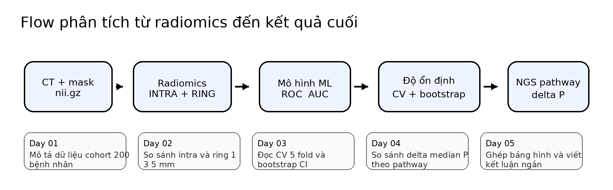

# EGFR Radiomics - Mini Bootcamp

Website này dùng cho học sinh THPT tự học trên Colab theo đúng flow của báo cáo phân tích.

## Flow của toàn bộ khóa học

Luồng chính đi theo 5 bước:

- từ ảnh CT và mask tạo vùng trong u và vùng quanh u
- trích xuất radiomics và tạo bảng đặc trưng
- huấn luyện mô hình để đọc ROC và AUC
- kiểm tra độ ổn định bằng cross validation và bootstrap
- nối với subset NGS để đọc delta P theo pathway

## Mục tiêu chung

Sau 5 buổi, học sinh cần làm được 5 việc:

- mô tả dữ liệu cohort
- chạy mô hình và đọc AUC
- kiểm tra độ ổn định bằng cross validation và bootstrap
- đọc delta P theo pathway trên subset NGS
- ghép kết quả thành một bộ output ngắn gọn để nói lại đúng ý của báo cáo

## Cấu trúc 5 buổi

- Day 01  Mô tả dữ liệu và Table 1
- Day 02  Hiệu năng mô hình và so sánh ROI
- Day 03  Độ ổn định và leakage
- Day 04  Delta P theo pathway NGS
- Day 05  Ghép kết quả thành bộ output cuối

## Bắt đầu từ đâu

- mở trang Hướng dẫn học sinh
- vào đúng buổi học ở menu bên trái
- đọc phần Mục tiêu và Nội dung
- bấm Open in Colab để chạy notebook

## Dữ liệu dùng trong website

Website dùng bộ dữ liệu demo để học sinh nhìn được đúng flow code mà không phải xử lý dữ liệu thật.

- cohort demo 200 bệnh nhân
- subset NGS demo 64 bệnh nhân

## Tài liệu đi kèm

- mỗi buổi có 1 file slide riêng
- mỗi buổi có 1 notebook riêng
- các hình và bảng demo đã được lưu trong thư mục results
